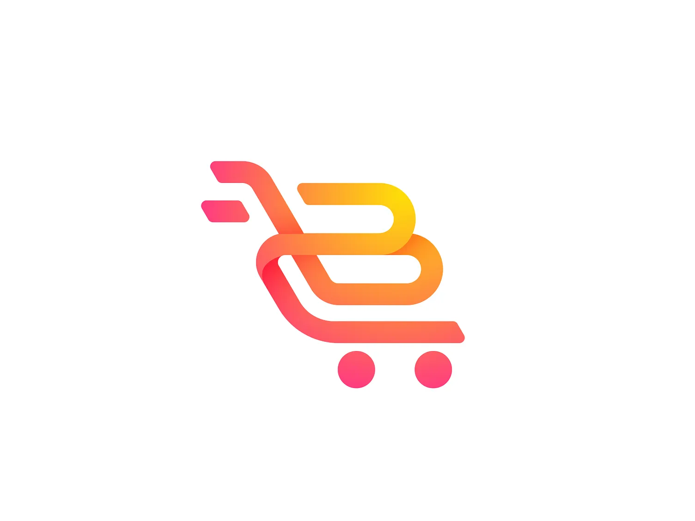

# E-Commerce Single Merchant Platform

A comprehensive single-vendor e-commerce solution built with Laravel and Vue.js 3, featuring a modern dashboard for managing products, orders, users, and settings.



## 🚀 Features

### 🛍️ Product Management
- **Product Catalog**: Manage products with categories, variants, and inventory
- **Category System**: Hierarchical category management with image support
- **Inventory Control**: Track stock levels with low stock alerts
- **Product Variants**: Support for different product options and SKUs
- **Media Management**: Upload and manage product images

### 📦 Order Management
- **Order Processing**: Manage order status and fulfillment
- **Order History**: View and search past orders with filtering
- **Order Details**: Comprehensive order information and customer data
- **Status Updates**: Update order status with tracking information

### 👥 User & Role Management
- **Role-based Access Control**: Granular permissions system
- **User Management**: Create, edit, and manage user accounts
- **Profile System**: User profiles with contact information
- **Activity Logs**: Track user actions and system events

### 📊 Dashboard & Analytics
- **Overview**: Key metrics and statistics at a glance
- **Sales Reports**: View sales performance over time
- **Product Analytics**: Track product performance
- **Customer Insights**: View customer activity and order history

### ⚙️ System Configuration
- **Settings Management**: Configure store settings and preferences
- **Theme Support**: Light/dark mode toggle
- **API Access**: RESTful API for integration with other systems

## 🛠️ Tech Stack

### Backend
- **PHP 8.1+**
- **Laravel 10.x**
- **MySQL/MariaDB** (Primary database)
- **Redis** (for caching and queues)
- **Laravel Sanctum** (API Authentication)
- **Spatie Laravel Permission** - For RBAC
- **Spatie Laravel Activity Log** - For activity tracking
- **Spatie Laravel Media Library** - For media management

### Frontend
- **Vue.js 3** - Composition API
- **Pinia** - State Management
- **Vue Router** - Client-side routing
- **Tailwind CSS** - Utility-first CSS framework
- **Headless UI** - Unstyled UI components
- **Heroicons** - SVG icons
- **Axios** - HTTP client
- **Chart.js** - Data visualization
- **Vue Toastification** - Toast notifications

### Development Tools
- **Vite** - Frontend build tool
- **Laravel Breeze** - Authentication scaffolding
- **PHPUnit** - Testing framework
- **ESLint** - JavaScript linter
- **Prettier** - Code formatter

## 🚀 Installation

### Prerequisites
- PHP 8.1 or higher
- Composer
- Node.js 16+ and NPM
- MySQL 5.7+ or MariaDB 10.3+
- Redis (for caching and queues)

### Setup Instructions

1. Clone the repository:
   ```bash
   git clone [repository-url]
   cd ecommerce-platform
   ```

2. Install PHP dependencies:
   ```bash
   composer install
   ```

3. Install JavaScript dependencies:
   ```bash
   npm install
   ```

4. Create and configure `.env` file:
   ```bash
   cp .env.example .env
   php artisan key:generate
   ```

5. Configure your database and Redis settings in `.env`

6. Run migrations and seeders:
   ```bash
   php artisan migrate --seed
   ```

7. Build frontend assets:
   ```bash
   npm run build
   ```

8. Start the development server:
   ```bash
   php artisan serve
   ```

9. Access the application at `http://localhost:8000`

### Default Admin Credentials
- Email: admin@example.com
- Password: password

## 📚 Documentation

### API Documentation
API documentation is available in the `e_commerce_api_complete.postman_collection.json` file which can be imported into Postman.

### Directory Structure
- `app/Http/Controllers` - API and web controllers
- `app/Models` - Eloquent models
- `database/migrations` - Database migrations
- `database/seeders` - Database seeders
- `resources/views` - Blade templates
- `resources/js` - Frontend Vue.js components
- `routes` - Application routes

## 🤝 Contributing

1. Fork the repository
2. Create your feature branch (`git checkout -b feature/AmazingFeature`)
3. Commit your changes (`git commit -m 'Add some AmazingFeature'`)
4. Push to the branch (`git push origin feature/AmazingFeature`)
5. Open a Pull Request

## 📄 License

This project is licensed under the MIT License - see the [LICENSE](LICENSE) file for details.

## 🙏 Acknowledgments

- Laravel Community
- Vue.js Community
- All contributors who have helped improve this project
- **Server**: Linux/Unix-based (Ubuntu 22.04 LTS recommended) or Windows 10/11 with WSL2
- **Web Server**: Nginx 1.20+ or Apache 2.4+ with mod_rewrite enabled
- **PHP**: 8.2+ with the following extensions:
  - BCMath, Ctype, cURL, DOM, Fileinfo, JSON, Mbstring, OpenSSL, PDO, Tokenizer, XML, GD/ImageMagick
- **Database**: MySQL 8.0+ or MariaDB 10.4+ / PostgreSQL 13+
- **Cache**: Redis 6.0+ or Memcached
- **Node.js**: 18.x LTS (includes npm 9.x)
- **Composer**: 2.5+
- **Memory**: Minimum 2GB RAM (4GB recommended for production)
- **Storage**: Minimum 10GB free space (SSD recommended for better performance)

### 🛠️ Setup Instructions

#### 1. Clone the Repository
```bash
git clone https://github.com/Ziad-Abaza/E-Commerce-single-merchant.git
cd ecommerce-single-merchant
```

#### 2. Install Backend Dependencies
```bash
composer install --optimize-autoloader --no-dev
```

#### 3. Install Frontend Dependencies
```bash
npm ci --production
```

#### 4. Environment Configuration
```bash
cp .env.example .env
php artisan key:generate
```

#### 5. Database Setup
Edit `.env` with your database credentials:
```env
DB_CONNECTION=mysql
DB_HOST=127.0.0.1
DB_PORT=3306
DB_DATABASE=your_database
DB_USERNAME=your_username
DB_PASSWORD=your_password

# Redis Configuration (recommended for caching and queues)
REDIS_HOST=127.0.0.1
REDIS_PASSWORD=null
REDIS_PORT=6379

# Queue Configuration
QUEUE_CONNECTION=redis
```

#### 6. Application Setup
```bash
# Set application to production mode
php artisan config:cache
php artisan route:cache
php artisan view:cache

# Generate application key
php artisan key:generate --force

# Link storage
php artisan storage:link

# Run migrations and seeders
php artisan migrate --force --seed

# Clear all caches
php artisan optimize:clear
```

#### 7. Build Frontend Assets
For production:
```bash
npm run build
```

#### 8. Configure Web Server
**Nginx Configuration** (`/etc/nginx/sites-available/yourdomain.com`):
```nginx
server {
    listen 80;
    server_name yourdomain.com www.yourdomain.com;
    root /var/www/your-project/public;

    add_header X-Frame-Options "SAMEORIGIN";
    add_header X-Content-Type-Options "nosniff";

    index index.php;

    charset utf-8;

    location / {
        try_files $uri $uri/ /index.php?$query_string;
    }

    location = /favicon.ico { access_log off; log_not_found off; }
    location = /robots.txt  { access_log off; log_not_found off; }

    error_page 404 /index.php;

    location ~ \.php$ {
        fastcgi_pass unix:/var/run/php/php8.2-fpm.sock;
        fastcgi_param SCRIPT_FILENAME $realpath_root$fastcgi_script_name;
        include fastcgi_params;
    }

    location ~ /\.(?!well-known).* {
        deny all;
    }
}
```

#### 9. Set Proper Permissions
```bash
sudo chown -R www-data:www-data /var/www/your-project
sudo chmod -R 755 /var/www/your-project/storage
sudo chmod -R 755 /var/www/your-project/bootstrap/cache
```

#### 10. Configure Queue Workers
Set up a process manager like Supervisor to keep the queue worker running:

`/etc/supervisor/conf.d/laravel-worker.conf`:
```ini
[program:laravel-worker]
process_name=%(program_name)s_%(process_num)02d
command=php /var/www/your-project/artisan queue:work --sleep=3 --tries=3 --max-time=3600
autostart=true
autorestart=true
stopasgroup=true
killasgroup=true
user=www-data
numprocs=2
redirect_stderr=true
stdout_logfile=/var/www/your-project/storage/logs/worker.log
stopwaitsecs=3600
```

#### 11. Schedule Tasks
Add this cron entry to your server (run `crontab -e`):
```
* * * * * cd /var/www/your-project && php artisan schedule:run >> /dev/null 2>&1
```

#### 12. Access the Application
- Frontend: https://yourdomain.com
- Admin Dashboard: https://yourdomain.com/dashboard
- Default Admin Credentials:
  - Email: admin@example.com
  - Password: ChangeMe123!

> **Security Note**: Change the default admin password immediately after first login.

## 🔒 Permissions

The system uses a role-based access control (RBAC) system with the following default roles:

- **Super Admin**: Full access to all features
- **Admin**: Access to most features except user management
- **Manager**: Can manage products and orders
- **Customer**: Can place orders and manage their profile

## 📄 API Documentation

The application provides a comprehensive RESTful API with the following endpoints:

### Public API Endpoints
- `GET /api/public/home` - Get homepage data
- `GET /api/public/settings` - Get application settings
- `GET /api/public/products` - List all products
- `GET /api/public/products/{id}` - Get product details
- `POST /api/public/contact` - Submit contact form
- `GET /api/public/categories` - List all categories
- `GET /api/public/categories/parents` - Get parent categories
- `GET /api/public/categories/tree` - Get category tree
- `GET /api/public/categories/{id}/products` - Get products by category
- `GET /api/public/categories/{id}/subcategories` - Get subcategories

### Authenticated User Endpoints
- `GET /api/user` - Get authenticated user details
- `GET /api/user/orders` - Get user's orders
- `GET /api/user/addresses` - Manage user addresses
- `GET /api/user/payment-methods` - Manage payment methods

### Admin Dashboard Endpoints
- `GET /api/dashboard/overview` - Get dashboard overview
- `GET /api/dashboard/analytics` - Get analytics data
- `GET /api/dashboard/recent-orders` - Get recent orders
- `GET /api/dashboard/top-products` - Get top-selling products

### User Management (Admin)
- `GET /api/dashboard/users` - List all users
- `POST /api/dashboard/users` - Create new user
- `GET /api/dashboard/users/{id}` - Get user details
- `POST /api/dashboard/users/{id}` - Update user
- `DELETE /api/dashboard/users/{id}` - Delete user
- `POST /api/dashboard/users/{id}/restore` - Restore soft-deleted user
- `POST /api/dashboard/users/{id}/assign-role` - Assign role to user

### Role Management (Admin)
- `GET /api/dashboard/roles` - List all roles
- `POST /api/dashboard/roles` - Create new role
- `GET /api/dashboard/roles/{id}` - Get role details
- `POST /api/dashboard/roles/{id}` - Update role
- `DELETE /api/dashboard/roles/{id}` - Delete role

### Product Management (Admin)
- `GET /api/dashboard/products` - List all products
- `POST /api/dashboard/products` - Create new product
- `GET /api/dashboard/products/{id}` - Get product details
- `POST /api/dashboard/products/{id}` - Update product
- `DELETE /api/dashboard/products/{id}` - Delete product
- `POST /api/dashboard/products/import` - Import products
- `GET /api/dashboard/products/export` - Export products

### Order Management (Admin)
- `GET /api/dashboard/orders` - List all orders
- `GET /api/dashboard/orders/{id}` - Get order details
- `POST /api/dashboard/orders/{id}/status` - Update order status
- `GET /api/dashboard/orders/export` - Export orders

### Category Management (Admin)
- `GET /api/dashboard/categories` - List all categories
- `POST /api/dashboard/categories` - Create new category
- `GET /api/dashboard/categories/{id}` - Get category details
- `POST /api/dashboard/categories/{id}` - Update category
- `DELETE /api/dashboard/categories/{id}` - Delete category

### Authentication
- `POST /api/login` - User login
- `POST /api/register` - User registration
- `POST /api/logout` - User logout
- `POST /api/forgot-password` - Request password reset
- `POST /api/reset-password` - Reset password
- `GET /api/user` - Get authenticated user

### API Features
- **Authentication**: Laravel Sanctum for API token authentication
- **Rate Limiting**: Configured for API endpoints
- **Request Validation**: Built-in request validation
- **Error Handling**: Standardized JSON error responses
- **Pagination**: For list endpoints
- **Filtering & Sorting**: Available on most list endpoints
- **Search**: Full-text search on relevant models
- **Caching**: Redis-based caching for improved performance

## 🧪 Testing

The application comes with a comprehensive test suite using PHPUnit. Tests are configured to run with an in-memory SQLite database for fast execution.

### Running Tests

Run all tests:
```bash
php artisan test
```

Run specific test file:
```bash
php artisan tests/Feature/ExampleTest.php
```

Run specific test method:
```bash
php artisan tests/Feature/ExampleTest.php --filter=test_basic_test
```

Run with code coverage (requires Xdebug or PCOV):
```bash
XDEBUG_MODE=coverage php artisan test --coverage-html=coverage
```

### Test Configuration
- **Environment**: Testing
- **Database**: SQLite in-memory
- **Cache**: Array driver
- **Session**: Array driver
- **Mail**: Array driver (emails are not actually sent)
- **Queue**: Synchronous (jobs run immediately)

### Test Suites
- **Unit Tests**: `tests/Unit/` - Test individual classes and components
- **Feature Tests**: `tests/Feature/` - Test API endpoints and application features

### Writing Tests
Example test case:

```php
<?php

test('products can be listed', function () {
    $response = $this->get('/api/public/products');
    $response->assertStatus(200);
});
```

### Testing Best Practices
- Use database transactions for tests that modify data
- Create test data using Laravel's model factories
- Test both success and failure scenarios
- Keep tests focused and independent
- Use meaningful test names that describe the behavior being tested

## 🛡️ Security

The application implements multiple layers of security to protect against common web vulnerabilities:

### Authentication & Authorization
- **Laravel Sanctum** for API token authentication
- Role-Based Access Control (RBAC) with Spatie Laravel Permission
- Secure password hashing with Bcrypt
- Email verification for user registration
- Password reset functionality
- Account lockout after multiple failed login attempts

### Protection Against Common Attacks
- **CSRF Protection**: Built-in Laravel CSRF protection for web routes
- **XSS Protection**: Blade templating engine automatically escapes output
- **SQL Injection**: Laravel's Eloquent ORM and query builder use PDO parameter binding
- **XSS & Injection**: Input validation and sanitization
- **CORS**: Configured to allow requests only from trusted origins
- **Rate Limiting**: Implemented on authentication endpoints
- **Secure Headers**: Includes security headers like X-XSS-Protection, X-Content-Type-Options, etc.
- **HTTPS**: Enforced in production environment

### Data Protection
- Encrypted cookies and sessions
- Hidden sensitive data in JSON responses
- Logging of security-relevant events
- Secure file upload handling

### API Security
- Token-based authentication
- Token expiration and revocation
- Limited token abilities (scopes)
- Rate limiting on API endpoints
- CORS policy for frontend-backend communication

### Best Practices
- Regular dependency updates
- Environment-based configuration
- Secure session management
- Secure password reset flow
- Activity logging for sensitive operations

## 🤝 Contributing

1. Fork the project
2. Create your feature branch (`git checkout -b feature/AmazingFeature`)
3. Commit your changes (`git commit -m 'Add some AmazingFeature'`)
4. Push to the branch (`git push origin feature/AmazingFeature`)
5. Open a Pull Request

## 📝 License

This project is open-source software licensed under the [MIT License](https://opensource.org/licenses/MIT).

```
MIT License

Copyright (c) 2025 E-Commerce Single Merchant

Permission is hereby granted, free of charge, to any person obtaining a copy
of this software and associated documentation files (the "Software"), to deal
in the Software without restriction, including without limitation the rights
to use, copy, modify, merge, publish, distribute, sublicense, and/or sell
copies of the Software, and to permit persons to whom the Software is
furnished to do so, subject to the following conditions:

The above copyright notice and this permission notice shall be included in all
copies or substantial portions of the Software.

THE SOFTWARE IS PROVIDED "AS IS", WITHOUT WARRANTY OF ANY KIND, EXPRESS OR
IMPLIED, INCLUDING BUT NOT LIMITED TO THE WARRANTIES OF MERCHANTABILITY,
FITNESS FOR A PARTICULAR PURPOSE AND NONINFRINGEMENT. IN NO EVENT SHALL THE
AUTHORS OR COPYRIGHT HOLDERS BE LIABLE FOR ANY CLAIM, DAMAGES OR OTHER
LIABILITY, WHETHER IN AN ACTION OF CONTRACT, TORT OR OTHERWISE, ARISING FROM,
OUT OF OR IN CONNECTION WITH THE SOFTWARE OR THE USE OR OTHER DEALINGS IN THE
SOFTWARE.
```

## 🙏 Acknowledgments

- [Laravel](https://laravel.com/)
- [Vue.js](https://vuejs.org/)
- [Tailwind CSS](https://tailwindcss.com/)
- [Font Awesome](https://fontawesome.com/)
- [Spatie Permission](https://spatie.be/docs/laravel-permission/v5/introduction)

---

<div align="center">
  Made with ❤️ by Ziad Hassan
</div>
# e-commerce-whatsapp

